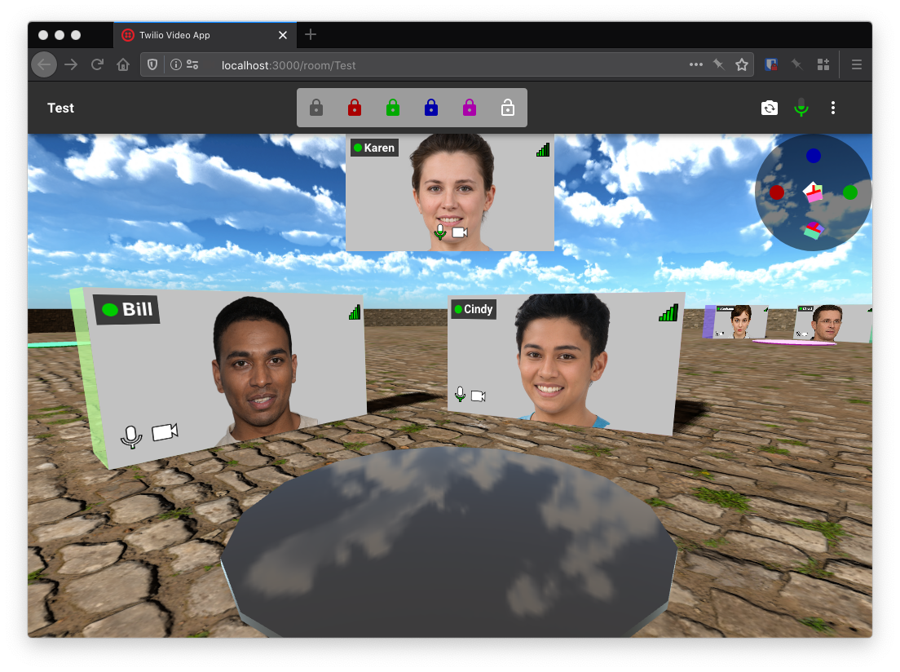

# Spatia - 3D Video Chat

Spatia is a fork of the [twilio sample](https://github.com/twilio/twilio-video-app-react) video chat application that renders participants video into a 3D world with positional audio.
It is designed for cocktail party/house party style meetings where groups of participants can naturally
congregate together in small groups. Audio is audible to nearby participants, and less audible to participants further away.

You can deploy the app using Twilio serverless, it requires a free Twilio account (no credit card required). See the [Twilio deploy instructions](../README.md).

## User Guide

Login to any room name, all participants using the same room name will be visible to each other.
Use keyboard (arrow keys or WASD) to navigate, or hold mouse on screen.
Hold `Shift` to move left/right instead of rotating.
Clicking one of the colored locks at the top will warp to the corresponding table and navigation will change to rotate around the table. Click the unlock icon to switch back to free navigation.

The map shows the location of other participants, clicking the map will also warp to that location.

## Caveats

* Chrome users are muted by default and must hold down the microphone button to talk ("push to talk").
  This is because Chrome does not perform echo cancellation,
  so this prevents Chrome users ruining the experience for other users.
  See this [Chrome bug](https://github.com/twilio/twilio-video.js/issues/323)
* The audio output selector is not functional,
  see the [WebAudio bug](https://github.com/WebAudio/web-audio-api-v2/issues/10)
* Some tests have not been updated and are failing